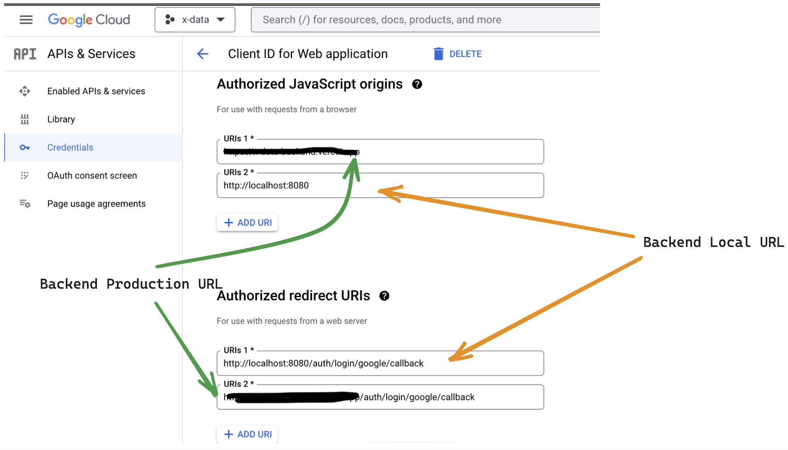

# Passport.js Authentication

## `📦 Built from scratch With`

- Node.js
- Express.js
- PostgreSQL
- Passport.js
- bcrypt.js
- Vercel - Hosting/Deployment

## `Frontend Setup`

Make sure to have below code in app.js or index.js in your frontend code. This attaches cookies to all axios request so you don't have to add withCredentials for future axios requests.

```
axios.defaults.withCredentials = true;
```

### `Local authentication (username and password):`

```
await axios.post("http..../auth/login/", {your_body})
```

### `OAuth authentication (google signin):`

The anchor tag allows users to be redirected to google signin page, then redirect back to frontend website.

```
<a href="http..../auth/login/google">
    Signin with Google
</a>
```


