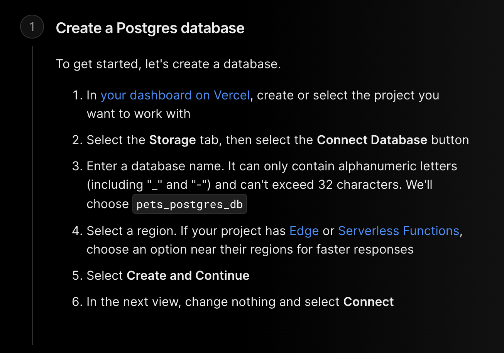

# Passport.js Authentication

## `📦 Built from scratch With`

- Node.js
- Express.js
- PostgreSQL
- Passport.js
- bcrypt.js
- Vercel - Hosting/Deployment

For Vercel Deployment (Without database), please follow:

https://shadowsmith.com/thoughts/how-to-deploy-an-express-api-to-vercel

For database deployment, please follow (and make sure to change the env in vercel so production server is accessing production database):

https://vercel.com/docs/storage/vercel-postgres/quickstart#create-a-postgres-database



## `Backend Setup`

If passport is already setup, you only need to set cookie config and cors config

### `Cookie Config`

```
// For localhost:
{
    maxAge: 7 * 24 * 60 * 60 * 1000, // The maximum age (in milliseconds) of a valid session.
    secure: false,
    httpOnly: false,
    sameSite: false,
}

{
        maxAge: 7 * 24 * 60 * 60 * 1000, // The maximum age (in milliseconds) of a valid session.
        secure: true, // Required to enable cookies to go through https for better security
        httpOnly: true, // Not allowing client-side javascript to interact with cookie, thus increasing security
        sameSite: "none", // Required to enable cors for cookies
      };
```

### `OAuth authentication (google signin):`

The anchor tag allows users to be redirected to google signin page, then redirect back to frontend website.

```
<a href="http..../auth/login/google">
    Signin with Google
</a>
```


## `Frontend Setup`

Make sure to have below code in app.js or index.js in your frontend code. This attaches cookies to all axios request so you don't have to add withCredentials for future axios requests.

```
axios.defaults.withCredentials = true;
```

### `Local authentication (username and password):`

```
await axios.post("http..../auth/login/", {your_body})
```

### `OAuth authentication (google signin):`

The anchor tag allows users to be redirected to google signin page, then redirect back to frontend website.

```
<a href="http..../auth/login/google">
    Signin with Google
</a>
```


